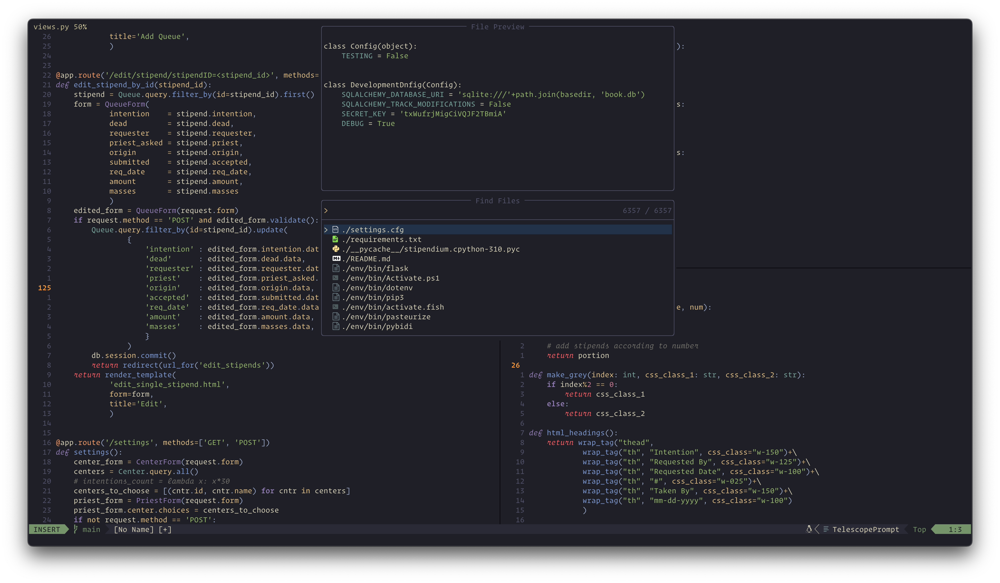

# corei8 NeoVim Configuration



## About

Simple configuration with fast loading and little more than the essentials.

Uses Packer as a plugin manager.

```nvim --startuptime``` = 0096.41ms

### Future

Working on built-in color schemes for easier switching.

<!---->

<!---->

## Usage

Clone into `~/.config/nvim`:

```bash
git clone https://github.com/corei8/CoreVim/ ~/.config/nvim
```

You will have to install [Node](https://nodejs.org/en/download/) for some of the LSP servers.

## Keymapping

Collection of my most used key combinations.

| Key(s)          | Action                  |
|---:             |:---                     |
| ```jj```        | ESC                     |
| ```<space>```   | leader                  |
| ```<space>cc``` | comment out line        |
| ```<space>cu``` | uncomment line          |
| ```<space>ga``` | git add                 |
| ```<space>gc``` | git commit with message |
| ```<space>gp``` | git push                |
| ```<space>gl``` | git pull                |
| ```<space>ff``` | telescope find file     |
| ```<space>fb``` | telescope find buffer   |

